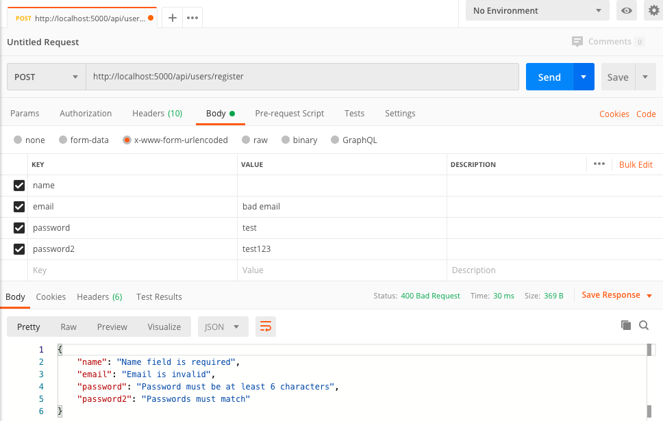

# weatherApp

OpenWeather API

This application displays an interface showing the difference between the temperature in the users current location and a city
supplied by the user (using openWeatherMap public API). The project was carried out using SCRUM agile software development techniques in Trello.

# Requirements

Firstly, you will have to set up a Mongo Atlas account AND an Open Weather Map account

1. Create a Mongo Atlas Account.
2. Deploy a Free Tier Cluster.
3. Whitelist Your Connection IP Address.
4. Create a Database User for Your Cluster.
5. Connect to Your Cluster.
6. Insert your MongoURI from Mongo Atlas into the keys.js file as shown below:

Following this (after setting up an Open Weather Map account) you should receive an email with your API key

simply place this key in the following file:

- client/src/dashboard/apiKeys.js

1. Download or clone the repository
2. cd AxonistaTest
3. npm install (backend dependencies)
4. cd client
5. npm install (client dependencies)

# To start

1. npm run dev (in root folder)
2. Open chrome browser and navigate to http://localhost:3000/ (if doesn't happen automatically)

# Usage

- Register an account (name, email, password)
- Login
- Allow location access from broswer to see location forecast
- Search for a weather forecast by entering a city name

# Testing
- This app was tested using JEST & Postman

JEST:

- Run npm run test in root project directory

Postman:

- Used to test login & register form validation

 
1. Install Postman
2. Select POST on dashboard
3. Paste API enpoint URLs into the field
4. Select Body & enter correct (and incorrect) values to test errors
5. Press send
